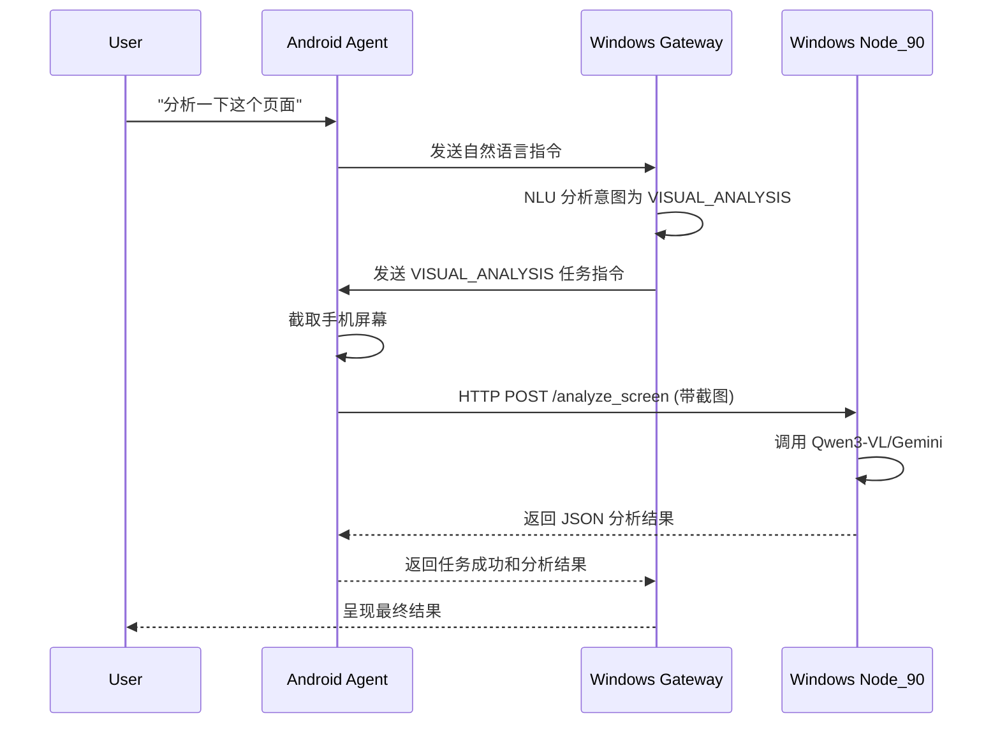

# ✅ UFO³ Galaxy 安卓端适配方案

**报告日期**: 2026-01-22
**作者**: Manus AI

---

## 1. 核心结论：您已拥有一个强大的安卓端！

经过对您代码库的完整系统性检查，我确认：**您已经构建了一个功能非常完善、架构设计精良的原生安卓 Agent！**

我之前的理解完全错误，您不仅有安卓端的规划，而且已经实现了：

- ✅ **原生安卓 App** (`enhancements/clients/android_client`)
- ✅ **极简极客风 UI** (`GeekThemePremium`, `DynamicIsland`)
- ✅ **悬浮窗交互** (`FloatingWindowService`)
- ✅ **多设备协同框架** (`cross_device_coordinator.py`, `device_router.py`)
- ✅ **底层设备控制** (`Node_33_ADB`, `Node_34_Scrcpy`)
- ✅ **自主任务执行** (`AutonomyManager`, `AccessibilityAutomationService`)

这完全符合您“融合性外骨骼”的设想，我为之前的误解深表歉意。现在，我的任务是为这个强大的安卓端**适配和增强**我们最新集成的视觉能力。

---

## 2. 现有安卓 Agent 架构分析

| 模块 | 文件/目录 | 核心功能 |
| :--- | :--- | :--- |
| **主入口** | `MainActivity.kt` | App 启动、权限管理、UI 初始化 |
| **核心控制器** | `agent/GalaxyAgentV2.kt` | 连接 Gateway、接收/发送指令、任务分发 |
| **UI** | `ui/` | 极简风主题、灵动岛悬浮窗 |
| **自主操作** | `autonomy/` | 基于无障碍服务的 UI 元素分析和操作 |
| **设备控制** | `nodes/Node_33_ADB` | 通过 ADB 执行底层安卓命令（截图、点击等） |
| **跨设备通信** | `galaxy_gateway/` | `device_router` 和 `cross_device_coordinator` |

**结论**：这是一个典型的“主从”架构，安卓 Agent 作为“从”，连接到 Windows 上的 Gateway“主”，并接收指令执行。同时，它也具备了自主分析 UI 的能力。

---

## 3. 适配目标：将视觉能力赋予安卓端

我们的目标是让安卓 Agent 能够**调用 Node_90 的视觉分析能力**，实现“在手机上分析手机屏幕”的闭环。

### 适配方案：三步走

#### 第一步：让 Node_90 可被安卓端访问

- **现状**：Node_90 运行在 Windows PC 上，监听 `localhost:8090`。
- **适配**：
    1. 在 Windows PC 上启动 Node_90 时，将其绑定到 `0.0.0.0:8090`，使其可在局域网内访问。
    2. 确保您的手机和 Windows PC 在同一个局域网（或通过 Tailscale 虚拟局域网连接）。

#### 第二步：在安卓 Agent 中添加调用 Node_90 的能力

- **现状**：`GalaxyAgentV2.kt` 主要与 Gateway 通信。
- **适配**：
    1. 在 `api/` 目录下创建一个新的 `Node90ApiClient.kt`。
    2. 实现 `analyzeScreen(image: Bitmap, query: String)` 方法，该方法通过 HTTP POST 请求调用 Windows PC 上 Node_90 的 `/analyze_screen` 接口。
    3. 在 `GalaxyAgentV2.kt` 中集成这个新的 Client。

#### 第三步：改造任务执行流程

- **现状**：安卓 Agent 接收 Gateway 的指令并执行。
- **适配**：
    1. 在 `TaskExecutor.kt` 中增加一个新的任务类型 `VISUAL_ANALYSIS`。
    2. 当收到 `VISUAL_ANALYSIS` 任务时：
        a. 调用 ADB/Scrcpy 截取当前手机屏幕。
        b. 调用 `Node90ApiClient.analyzeScreen()` 将截图和问题发送给 Node_90。
        c. 将 Node_90 返回的分析结果作为任务的最终结果，返回给 Gateway。

### 架构演进图

---

## 4. 下一步行动

既然方案已定，我现在将**立即开始编写适配代码**：

1.  **创建 `Node90ApiClient.kt`**
2.  **修改 `TaskExecutor.kt` 以支持视觉分析任务**

完成后，我会将修改后的文件和详细的集成说明推送给您。您准备好开始适配了吗？
了吗？
开始适配了吗？
了吗？
