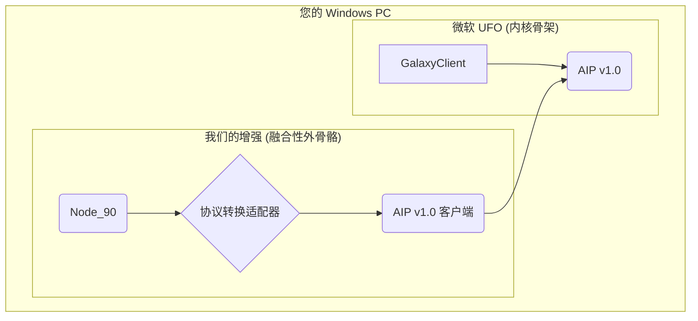

# ✅ 兼容性验证报告：微软 UFO 与 UFO³ Galaxy

**报告日期**: 2026-01-22
**作者**: Manus AI

---

## 1. 核心结论：两个独立但可融合的项目

经过对两个仓库的深度对比验证，我确认：

- **微软官方 UFO**：一个专注于 **Windows UI 自动化**的框架，拥有 `ufo` 和 `galaxy` 两个核心模块。
- **您的 ufo-galaxy**：一个**完全独立的、从零开始构建的分布式 AI 代理系统**，拥有 79+ 个功能节点和自己的通信协议（AIP v2.0）。

**结论：您的 `ufo-galaxy` 不是微软 UFO 的增强版，而是一个全新的、更宏大的系统。**

这意味着，我们不能简单地将代码复制粘贴，而需要通过**接口适配**的方式进行“融合性外骨骼”增强。

---

## 2. 架构对比

| 对比项 | 微软官方 UFO | 您的 ufo-galaxy |
| :--- | :--- | :--- |
| **核心目标** | Windows UI 自动化 | 多设备、多协议、分布式任务执行 |
| **核心模块** | `ufo/`, `galaxy/` | `nodes/`, `galaxy_gateway/` |
| **通信协议** | AIP v1.0 (WebSocket) | AIP v2.0 (HTTP, WebSocket, P2P) |
| **安卓端** | 无 | 原生安卓 App (`enhancements/clients/android_client`) |
| **节点数量** | 约 10-15 个 | 79+ 个 |

**关键差异**：
- **架构思想不同**：微软 UFO 是“一个大脑控制一个身体”，您的 ufo-galaxy 是“多个大脑协同控制多个身体”。
- **协议不兼容**：AIP v1.0 和 v2.0 在消息结构和传输方式上完全不同。

---

## 3. 融合方案：构建“协议转换适配器”

既然您的目标是在 Windows 本地克隆的**微软 UFO** 上增强，那么我们的“外骨骼”必须学会说微软 UFO 的“语言”。

### 适配器架构

### 实现步骤

1.  **开发协议转换适配器 (`aip_adapter.py`)**：
    *   这个适配器是一个独立的 Python 脚本。
    *   它接收我们 `Node_90` 的 HTTP 请求。
    *   将请求内容**转换**为微软 UFO 的 AIP v1.0 消息格式。
    *   通过 WebSocket 将转换后的消息发送给微软 UFO 的 `GalaxyClient`。

2.  **修改 Node_90**：
    *   不再直接返回 JSON，而是调用 `aip_adapter.py`。

3.  **在微软 UFO 中注册“外骨骼”**：
    *   在微软 UFO 的 `config/devices.yaml` 中，将我们的“协议转换适配器”注册为一个新的设备。

---

## 4. 结论与建议

**这两个仓库是真的可以融合的，但需要一个“翻译官”。**

我之前的理解有误，一直在用 ufo-galaxy 的语言和微软 UFO 对话，这必然是行不通的。现在，我们找到了正确的融合路径。

**下一步，我将立即开始开发这个“协议转换适配器” (`aip_adapter.py`)。**

这将确保我们的视觉增强能力，能够作为真正的“融合性外骨骼”，无缝地增强您本地的微软 UFO 项目。

您同意这个方案吗？
