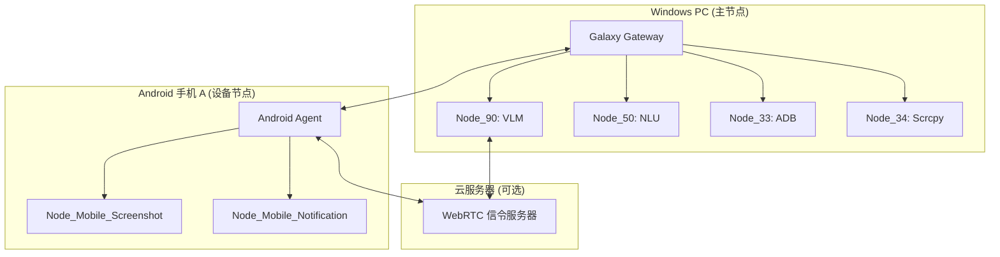

# UFO³ Galaxy 部署架构文档

**作者**: Manus AI  
**日期**: 2026-01-22  
**版本**: 1.0  
**目标**: 明确 UFO³ Galaxy 系统中每个节点的运行位置、资源需求和依赖关系

---

## 1. 核心理念：混合式、分布式、去中心化

UFO³ Galaxy 不是一个单一的程序，而是一个由多个独立、可互操作的**节点 (Node)** 组成的**分布式系统**。每个节点都是一个微服务，负责一项特定的功能。

- **主节点 (Master Node)**: 通常是您的 Windows PC，负责运行核心的 **Galaxy Gateway** 和大部分计算密集型节点。
- **设备节点 (Device Node)**: 您的手机、平板等设备，运行轻量级的 **Agent** 和设备专属的节点。
- **云节点 (Cloud Node)**: （可选）在云服务器上运行需要公网 IP 或高可用性的节点，如信令服务器。

## 2. 部署架构图

## 3. 节点部署详情

### 3.1 Windows PC (主节点)

这是系统的“大脑”，负责任务分解、指令分发和重量级计算。

| 节点 | 运行方式 | 资源消耗 | 依赖 |
| :--- | :--- | :--- | :--- |
| **Galaxy Gateway** | `python gateway_service_v3.py` | 低 (CPU < 5%, RAM < 200MB) | Python 3.11, FastAPI, Uvicorn, WebSocket |
| **Node_90: VLM** | `python main.py` | **高** (GPU/NPU, RAM > 2GB) | Python 3.11, FastAPI, `aiortc`, `pillow` |
| **Node_50: NLU** | `python main.py` | 中 (CPU 10-20%, RAM 500MB) | Python 3.11, Transformers, PyTorch |
| **Node_33: ADB** | `python main.py` | 低 (CPU < 2%, RAM < 100MB) | Android SDK Platform Tools (adb.exe) |
| **Node_34: Scrcpy** | `python main.py` | 低 (CPU < 2%, RAM < 100MB) | Scrcpy (scrcpy.exe) |

### 3.2 Android 手机 (设备节点)

作为“四肢”，负责执行物理世界的操作和采集设备数据。

| 节点 | 运行方式 | 资源消耗 | 依赖 |
| :--- | :--- | :--- | :--- |
| **Android Agent** | App (后台服务) | 中 (CPU 5-15%, RAM 200-400MB) | Android 8.0+, `libwebrtc` |
| **Node_Mobile_Screenshot** | Agent 内置 | 低 | `MediaProjection` API |
| **Node_Mobile_Notification** | Agent 内置 | 低 | Android SDK |

### 3.3 云服务器 (可选)

主要用于需要公网 IP 的服务，如 WebRTC 信令服务器，以便在不同网络环境下建立 P2P 连接。

| 节点 | 运行方式 | 资源消耗 | 依赖 |
| :--- | :--- | :--- | :--- |
| **WebRTC 信令服务器** | `python signaling.py` | 低 (CPU < 5%, RAM < 100MB) | Python 3.11, `aiortc`, WebSocket |

### 3.4 容器化部署 (Podman/Docker)

**强烈建议**将 PC 端的 Python 节点（除需要 GPU 的 VLM 节点外）通过容器化进行管理。

- **优势**: 环境隔离、快速部署、易于管理。
- **实现**: 我可以为您提供每个节点的 `Dockerfile` 或 `Containerfile`。

---

## 4. 总结

- **核心在 PC**: 您的 Windows PC 是整个系统的核心，承载了大部分计算任务。
- **手机是延伸**: 手机作为“传感器”和“执行器”，通过轻量级 Agent 接入系统。
- **云是桥梁**: 云服务器是可选的，主要用于解决复杂的网络穿透问题。
- **容器是未来**: 容器化是管理这些分布式节点的最佳实践。

这份文档清晰地说明了每个部分的职责和运行环境。现在，我们可以放心地开始实施 WebRTC 功能了。
