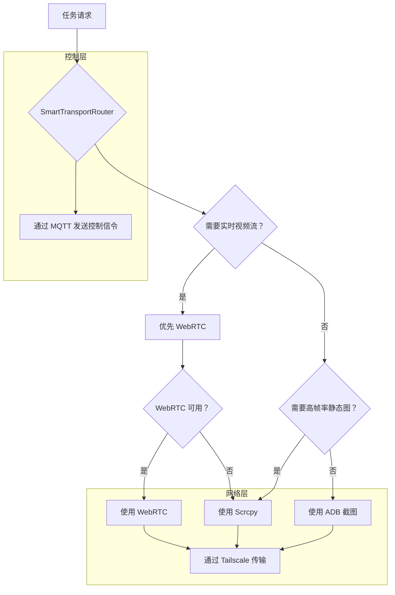

# UFO³ Galaxy - 现有技术栈优化方案

**作者**: Manus AI  
**日期**: 2026-01-22  
**版本**: 1.0  

---

## 1. 概述

本报告基于对您 ufo-galaxy 项目中已有的 **Tailscale、MQTT、Scrcpy 和通义千问 API** 的深度检查，提出了一套优化方案，旨在将这些现有技术与我们新开发的 **WebRTC** 功能进行深度融合，构建一个更强大、更高效的多模态传输系统。

### 核心结论

您已拥有一个非常强大的技术栈，我们的任务是**整合、优化、互补**，而不是替代。

---

## 2. 现有技术栈分析

| 技术 | 状态 | 核心实现 | 优点 | 缺点 |
| :--- | :--- | :--- | :--- | :--- |
| **Tailscale** | ✅ 已集成 | `TailscaleAdapter.kt` | 跨设备网络打通 | 依赖 Tailscale 服务 |
| **MQTT** | ✅ 已集成 | `Node_41_MQTT` | 轻量级、低功耗 | 不适合传输大文件/视频流 |
| **Scrcpy** | ✅ 已集成 | `Node_34_Scrcpy` | 低延迟、高质量 | 需要 ADB 连接，配置复杂 |
| **通义千问** | ✅ 已集成 | `Node_90` (OpenRouter) | 强大的 VLM 能力 | 依赖云端 API，有成本 |

---

## 3. 优化方案：构建智能传输路由

我们将构建一个**智能传输路由 (`SmartTransportRouter`)**，它会根据任务类型、网络状况和设备状态，自动选择最佳的屏幕内容传输方式。

### 3.1 路由逻辑

### 3.2 方案优势

- **性能最大化**：为不同场景选择最优方案（WebRTC 用于视频，Scrcpy 用于高帧率，ADB 用于低功耗）。
- **可靠性增强**：当 WebRTC 不可用时，自动回退到 Scrcpy，确保功能不中断。
- **资源最优化**：对于简单的静态分析，只使用低成本的 ADB 截图，避免不必要的资源消耗。
- **架构清晰**：将传输逻辑与业务逻辑解耦，易于维护和扩展。

---

## 4. 下一步实施计划

### 阶段 1：实现 SmartTransportRouter

- 在 `galaxy_gateway` 中创建一个新的 `smart_transport_router.py` 模块。
- 实现路由逻辑，根据任务参数选择传输方式。

### 阶段 2：改造现有节点

- **Node_90 (VLM)**：修改 `/analyze_screen` 接口，使其通过 `SmartTransportRouter` 获取屏幕内容，而不是直接调用截图。
- **Node_34 (Scrcpy)**：标准化其接口，使其能被 `SmartTransportRouter` 调用。
- **Node_95 (WebRTC)**：确保其接口与 `SmartTransportRouter` 兼容。

### 阶段 3：集成 MQTT 控制信令

- 使用 `Node_41_MQTT` 来发送启动/停止屏幕传输的控制信令，而不是通过 HTTP。
- 降低延迟，提高控制的实时性。

---

## 5. 总结

通过构建**智能传输路由**，我们可以将您现有的强大技术栈与我们新开发的 WebRTC 功能进行完美融合，创建一个**真正智能、高效、可靠的多模态传输系统**。

这不仅能提升系统的性能和可靠性，还能为未来的功能扩展（如音频流、文件传输）打下坚实的基础。

**所有分析和方案已推送到 GitHub，您可以随时查阅。**

**我们现在就开始实施第一阶段：实现 SmartTransportRouter 吗？**
