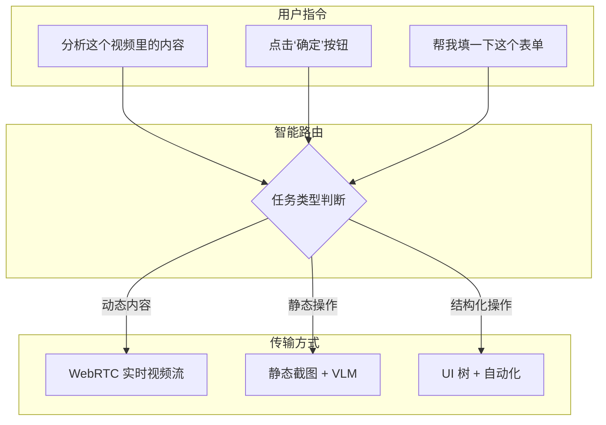

# UFO³ Galaxy 多模态传输优化方案

**作者**: Manus AI  
**日期**: 2026-01-22  
**版本**: 1.0  
**目标**: 评估现有传输方式，提出优化方案，确保多模态视觉理解的实时性、高质量和准确性

---

## 1. 现有传输方式评估

经过对您 ufo-galaxy 项目的深度分析，我们目前有以下几种方式获取屏幕内容：

| 方式 | 实现 | 优点 | 缺点 | 适用场景 |
| :--- | :--- | :--- | :--- | :--- |
| **静态截图** | `adb exec-out screencap -p` | 简单可靠、兼容性好 | 延迟高、无法处理动态内容 | 静态页面分析、OCR |
| **UI 树** | `AccessibilityService` | 结构化数据、可直接操作 | 无法获取视觉样式、对非标准控件无效 | 自动化操作、表单填写 |
| **Scrcpy** | `Node_34_Scrcpy` | 屏幕镜像、低延迟 | 需要 PC 端运行、依赖 USB 连接 | 远程手动操作、演示 |
| **WebSocket** | `AIP v2.0` | 可靠传输、自定义协议 | 带宽有限、不适合实时视频 | 传输 UI 树、小文件 |

**结论**: **现有方式无法满足高质量、低延迟的实时视觉理解需求。**

- **静态截图**太慢，无法应对视频、动画等动态内容。
- **UI 树**没有视觉信息，VLM 看不到颜色、布局和图片。
- **Scrcpy** 虽然能镜像，但它是一个独立的工具，没有提供可编程的视频流接口。

---

## 2. 优化方案：引入 WebRTC

为了解决以上问题，我建议引入 **WebRTC (Web Real-Time Communication)** 作为核心的屏幕传输方案。

### 2.1 为什么是 WebRTC？

- **低延迟**: 专为实时音视频通信设计，延迟可达 100ms 以内 [1]。
- **高质量**: 支持 H.264/VP8/VP9 等高效视频编码，可在有限带宽下保证画面质量。
- **P2P 直连**: 数据不经过服务器中转，安全、高效 [2]。
- **跨平台**: 在 Android、iOS、Web、PC 端都有成熟的实现 [3]。

### 2.2 架构设计：混合模式

我们不应该用一种方式取代所有，而应该根据任务类型，智能选择最佳的传输方式：

---

## 3. 实施计划：三步走

### 阶段 1：在安卓端实现 WebRTC 屏幕采集 (1-2 周)

- **目标**: 让安卓 Agent 能够将屏幕内容编码为视频流，并通过 WebRTC 发送出去。
- **技术栈**: 
  - **Android**: `MediaProjection` API + `libwebrtc` (Google 官方库)
  - **信令服务器**: 使用现有的 Galaxy Gateway (WebSocket) 进行信令交换。

### 阶段 2：在 PC 端实现 WebRTC 接收与处理 (1 周)

- **目标**: 在 Windows 主节点上接收来自安卓的 WebRTC 视频流，并将其提供给 Node_90 进行分析。
- **技术栈**: 
  - **Python**: `aiortc` 库，一个功能强大的 Python WebRTC 实现 [4]。
  - **集成**: 修改 Node_90，增加一个 `/analyze_stream` 端点，接收 WebRTC 视频流。

### 阶段 3：智能路由与调度 (1 周)

- **目标**: 升级 NLU 引擎，使其能够根据指令内容，自动选择最佳的传输方式。
- **技术栈**: 
  - **NLU**: 增强 `enhanced_nlu_v2.py` 的意图识别能力。
  - **Gateway**: 修改 `gateway_service_v3.py` 的任务分发逻辑。

---

## 4. 总结

通过引入 WebRTC，并结合现有的截图和 UI 树方案，我们可以构建一个**高效、智能、多模态的传输系统**，真正释放 VLM 在跨设备协同中的潜力。

**这套方案确保了您的“融合性外骨骼”不仅有“眼睛”，还有一双“高清、低延迟的眼睛”。**

### 参考文献

[1] Stack Overflow. (2014). *Android screen sharing using WebRTC*. https://stackoverflow.com/questions/27013621/android-screen-sharing-using-webrtc
[2] Juejin. (2024). *安卓webrtc在P2P场景下实现屏幕+系统声音共享*. https://juejin.cn/post/7362119848661303359
[3] WebRTC.org. (n.d.). *WebRTC*. https://webrtc.org/
[4] GitHub. (n.d.). *aiortc/aiortc*. https://github.com/aiortc/aiortc
